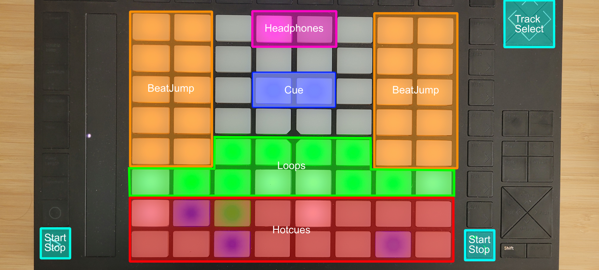

# Traktor Usage with Ableton Push 2

This repository provides programs, helper scripts, and resources for integrating [Traktor Pro 3](https://www.native-instruments.com/en/products/traktor/dj-software/traktor-pro-3/) with the [Ableton Push 2](https://www.ableton.com/en/push/).

Basically this allows to fully control Traktor Pro 3 with the Ableton Push 2 and also use the Push 2 display to show the current effects, current track, and other useful information.

## Features

- **Traktor Mapping**: Customized mappings for Ableton Push 2 to control Traktor Pro 3.
- **Display Driver**: Utilizes the Push 2 display for showing current effects and other functions with real-time feedback.
- **Resources**: A number of resources I found while researching which might be helpful

### Example




## Installation

I have only tested the setup on windows with Traktor Pro 3. I have not tested on Mac but I dont see why it shouldn't work, also I have not tested with Traktor Pro 4. If nothing mayor changed it should still work.

You need port 8080 free for the API to work.

### API for receiving updates from traktor

**Mac:**

  - Navigate to `/Applications/Native Instruments/Traktor Pro 3`
  - Right click Traktor.app, then click Show Package Contents
  - Navigate to Contents/Resources/qml/CSI
  - Make a backup of the D2 folder!
  - Replace the D2 folder with the one from this repo `traktor_api/D2`
  - Restart Traktor
  - If you don't own a Traktor Kontrol D2:
    - Go to Preferences > Controller Manager
    - Below the Device dropdown, click Add… > Traktor > Kontrol D2

**Windows:**

  - Navigate to `C:\Program Files\Native Instruments\Traktor Pro 3\Resources64\qml\CSI`
  - Make a backup of the D2 folder!
  - Replace the D2 folder with the one from this repo `traktor_api/D2`
  - Restart Traktor
  - If you don't own a Traktor Kontrol D2:
    - Go to Preferences > Controller Manager
    - Below the Device dropdown, click Add… > Traktor > Kontrol D2


### Traktor mapping

Load the traktor mappings from `.\mappings\complete.tsi`.

- Launch Traktor, open the Preferences, and click on the Controller Manager Tab,
- Under Device Setup, click the Add button and select from the pull down menu Import TSI > Import Other
- Navigate to Traktor's settings folder and select the `.\mappings\complete.tsi` file 


Sometimes the encoder type is not set correctly. If the encoders are not working correctly, you can change the encoder type in the controller manager, this takes some time tho as you have to do it for every mapping using the encoders.


### Push 2 Display Driver

To install the push display driver, you need to have Rust installed. You can install Rust from [here](https://www.rust-lang.org/tools/install). To build the application for your current machine, just run

```
cd push2display2traktor
cargo build --release
```

If you omit the release option the screen refresh rate will be significantly lowered! 


## Usage

After installing and loading the mapping files in traktor just run the `push2display2traktor.exe` from the `push2display2traktor/target/releases` folder.

Should be similar on Mac!


